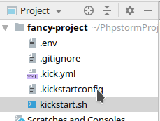

##  <b>&Oslash;-conf sdk</b> for agile software development

#### <kbd>git clone</kbd> and <kbd>./kickstart.sh</kbd>

 

##### - Boost agile development in teams / (open-source) communities 

##### - All configuration is stored inside the project repository

##### - Supports **Linux**, **MacOS** and **Windows** <small>*(Linux shell)*</small>

##### - IoT ready cross-platform builds for x86, arm32v7, arm64v8

