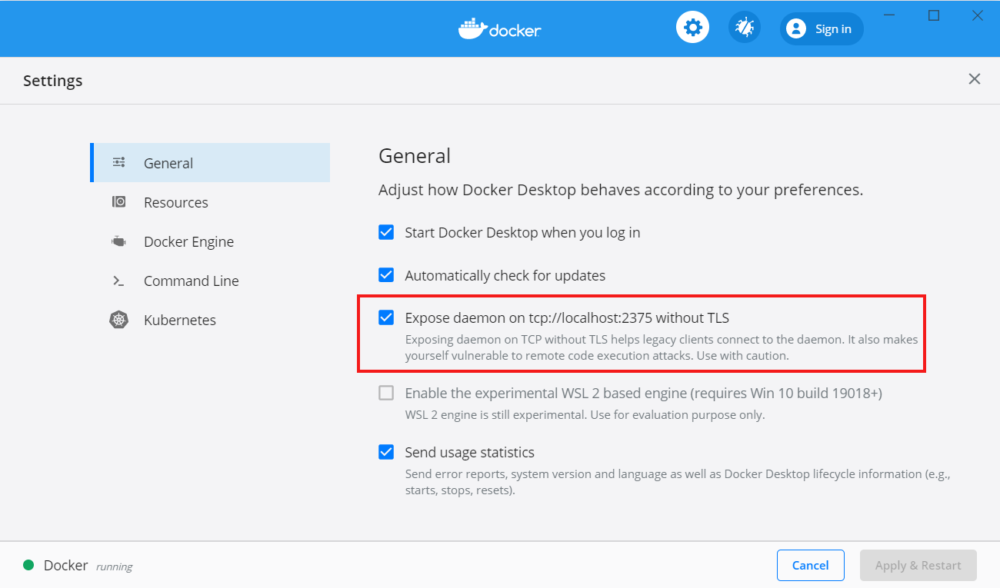
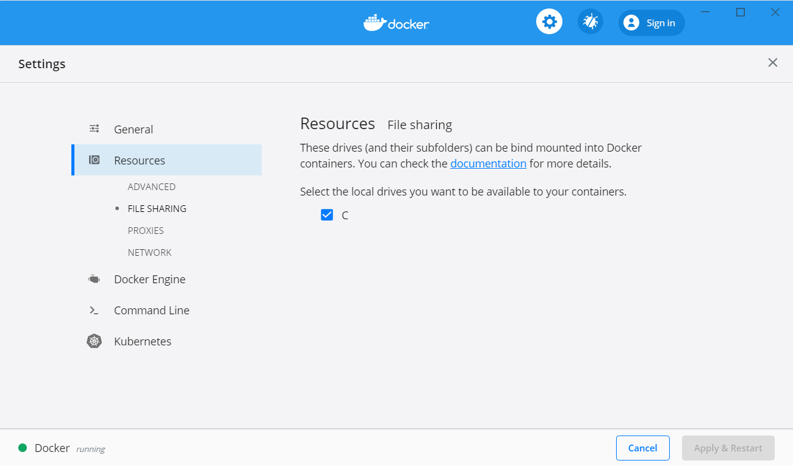

# Kickstart Windows Setup

This document covers
- Setup kickstart develompent environment on Windows10

## Setup Windows 10 workstation

This document assumes you have your project located in drive `C:`.

### Requirements
- Installed [Docker for Windows](https://docs.docker.com/docker-for-windows/install/)
- [Activated Windows Subsystem for Linux (WSL)](https://code.visualstudio.com/remote-tutorials/wsl/enable-wsl) 
- [Installed Ubuntu for Windows](https://ubuntu.com/tutorials/tutorial-ubuntu-on-windows#3-install-ubuntu-for-windows-10)

### Required Options in Docker for Windows
- Open Docker for Windows settings
    - Expose docker deamon
        1. Go to `General` settings
        2. To expose the docker deamon enable the marked option in the picture below
        
    
    - Enable fileshare in docker
        1. Go to `Resources` open the Subsetting `File Sharing`
        2. Mark all windows drives you want to share with docker like in the image shown below
        


### Configure the ubuntu shell

Open the command line pompt and enter

```bash
bash
```

You're now in the ubuntu bash. Enter the following lines to configure kickstart for windows:

```bash
sudo apt update && upgrade
sudo apt install docker.io
echo "export DOCKER_HOST=tcp://0.0.0.0:2375" >> ~/.kickstartconfig
echo "export KICKSTART_WIN_PATH=C:/" >> ~/.kickstartconfig
```

You will find your `C:/` drive under `/mnt/c`.

Go back to [getting started guide](../) and follow the instructions.


 

