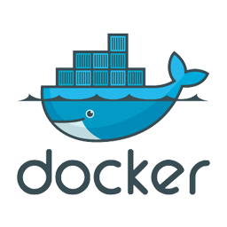

Speed up builds and deployments with intermediate-containers. Dockers overlay-fs will
download images specified in `from:`-sections of Dockerfiles only once. It is common practice to install software used across multiple
services using 'intermediate-containers'. Kickstart flavors are publicly maintained *intermediates on steroids* for various
platforms, languages and frameworks.

See the [getting-started guide](/getting-started) on how to start your projects using these base-containers.

| Name                                  | Synopsis                  | Documentation                                    |
|---------------------------------------|---------------------------|--------------------------------------------------|
| *Platform: **x86** (IBM-PC)*  |
| **`infracamp/kickstart-flavor-base`**     | Base image (Ubuntu 18.04) | [GitHub](https://github.com/infracamp/kickstart-flavor-base) - [DockerHub](https://hub.docker.com/r/infracamp/kickstart-flavor-base/) |
| **`infracamp/kickstart-flavor-gaia`**     | PHP7.2, Apache2 **new PHP7.4! see docs**          | [GitHub](https://github.com/infracamp/kickstart-flavor-gaia) - [DockerHub](https://hub.docker.com/r/infracamp/kickstart-flavor-gaia/) |
| **`infracamp/kickstart-flavor-jekyll`**   | Jekyll Github pages       | [GitHub](https://github.com/infracamp/kickstart-flavor-jekyll) - [DockerHub](https://hub.docker.com/r/infracamp/kickstart-flavor-jekyll/) |
| **`infracamp/kickstart-flavor-py3`**      | Python3, pip              | [GitHub](https://github.com/infracamp/kickstart-flavor-py3) - [DockerHub](https://hub.docker.com/r/infracamp/kickstart-flavor-py3/) |
| **`infracamp/kickstart-flavor-erebos`**   | nodejs, angular           | [GitHub](https://github.com/infracamp/kickstart-flavor-erebos) - [DockerHub](https://hub.docker.com/r/infracamp/kickstart-flavor-erebos/) |
| **`infracamp/kickstart-flavor-datalytics`** [alpha!]  | R,Python3,RStudio,Jupyter | [GitHub](https://github.com/infracamp/kickstart-flavor-datalytics) - [DockerHub](https://hub.docker.com/r/infracamp/kickstart-flavor-datalytics/) |
| **`infracamp/kickstart-flavor-sdi`**      | gcloud,azure,aws | [GitHub](https://github.com/infracamp/kickstart-flavor-sdi) - [DockerHub](https://hub.docker.com/r/infracamp/kickstart-flavor-sdi/) |

| *Platform: **arm32v7** (e.g. Raspberry Pi)*  <small>[Best practise arm32](arm32-tipps)  </small>    |
| **`infracamp/kickstart-flavor-arm32v7-base`**     | Base image (Ubuntu 18.04) | [GitHub](https://github.com/infracamp/kickstart-flavor-arm32v7-base) - [DockerHub](https://hub.docker.com/r/infracamp/kickstart-flavor-arm32v7-base/) |
| **`infracamp/kickstart-flavor-arm32v7-php7`**     | PHP7.2, Apache2 (eq. x86-gaia) | [GitHub](https://github.com/infracamp/kickstart-flavor-arm32v7-php7) - [DockerHub](https://hub.docker.com/r/infracamp/kickstart-flavor-arm32v7-php7/) |

# Prebuild service containers <small>ready to use software</small>

We offer management software containers for various tasks. These containers
are based on our flavored containers.

## Viper application container

| Name                                  | Synopsis                  | Documentation                                    |
|---------------------------------------|---------------------------|--------------------------------------------------|
| `infracamp/viper-smtpd`               | SMTPd Server              | [GitHub](https://github.com/infracamp/viper-smtpd) - [DockerHub](https://hub.docker.com/r/infracamp/viper-smtpd/) |
| `infracamp/redis`                     | Redis Server              | [GitHub](https://github.com/infracamp/redis) - [DockerHub](https://hub.docker.com/r/infracamp/redis/) |

## Rudl cloud management tools

| Name                                  | Synopsis                  | Documentation                                    |
|---------------------------------------|---------------------------|--------------------------------------------------|
| `infracamp/rudl-manager`              | Docker Cluster Manager    | [GitHub](https://github.com/infracamp/rudl-manager) - [DockerHub](https://hub.docker.com/r/infracamp/rudl-manager/) |

